## Task Management System Nexa
Aplikasi web untuk management data task karyawan. Memiliki fitur create task, update task, edit task, dan delete task. Aplikasi diproteksi dengan fitur autentikasi dengan token. Fitur autentikasi memuat login, register, dan logout. Password di proteksi dengan bcrypt.

## Fitur
 - Browse, Update, Create, Delete Task
 - See Detail Task
 - Login, Register, Logout App

## Instalasi dan cara pakai
1. Clone Repository
```bash
git clone https://github.com/MirzaAliA/task-management.git
```

2. Install Depedencies di Backend dan Frontend
```bash
cd task-management/frontend
npm install
```

```bash
cd task-management/backend
npm install
```

3. Jalankan Development Server di Backend dan Frontend
```bash
cd task-management/backend
nodemon app
```

```bash
cd task-management/frontend
npm run dev
```

4. Buka Frontend di browser
http://localhost:5173

## Tech Stack Frontend
 - React + Vite
 - React Router DOM
 - Bootstrap
 - TanStack Query

## Tech Stack Backend
 - Express.js
 - MySQL
 - TypeORM
 - JsonWebToken
 - Express Rate Limiter
 - BcryptJs

## Informasi Login Dummy
 - username: admin1
 - password: admin1

## Struktur Database
```bash
+---------------------+
|       user          |
+---------------------+
| user_id (PK)        |
| name                |
| username (UNIQUE)   |
| password            |
+----------+----------+
           |
           | 1 : n
           |
+----------v----------+
|        task          |
+----------------------+
| task_id (PK)         |
| user_id (FK)         |
| title                |
| description          |
| status               |
| deadline             |
| created_by           |
+----------------------+
```

## Screenshots
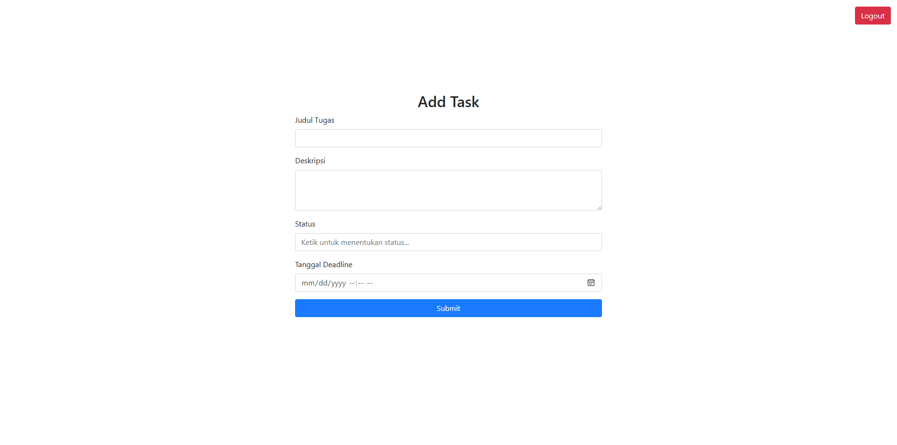
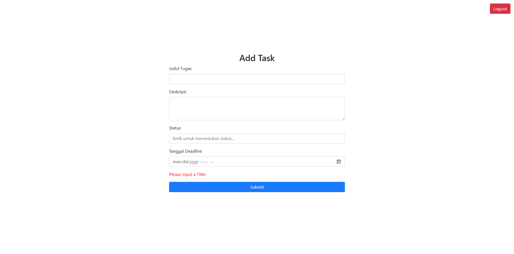
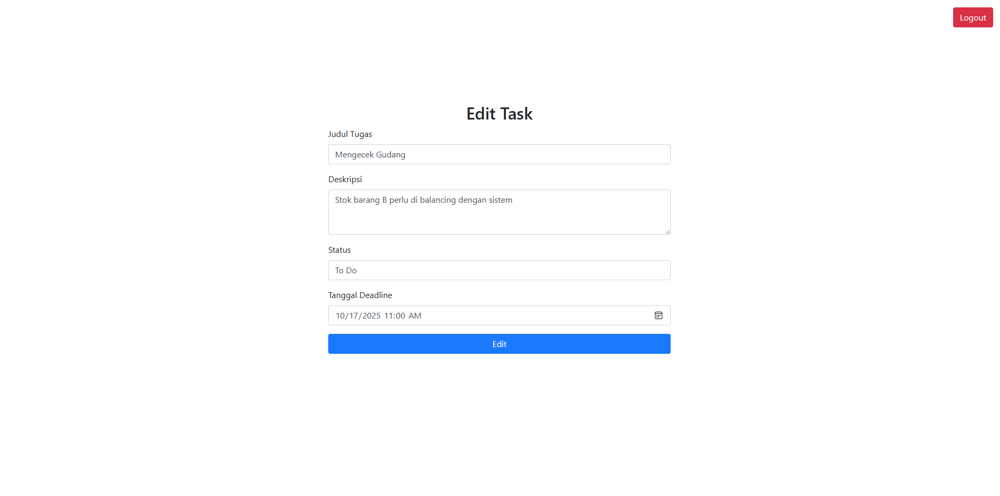
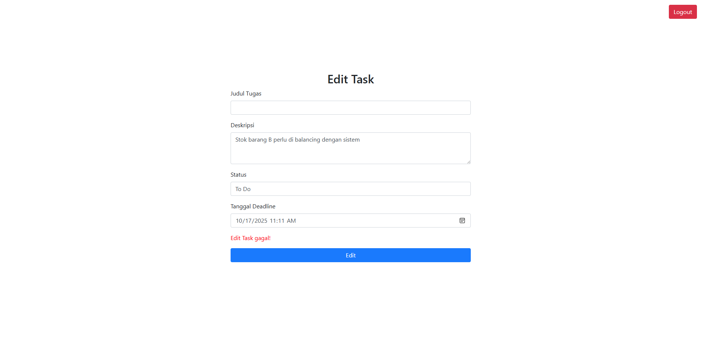
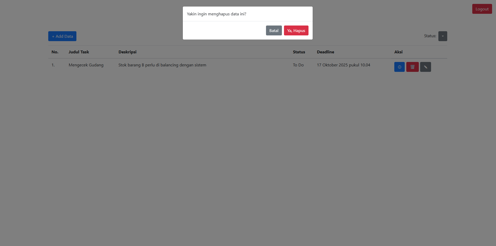
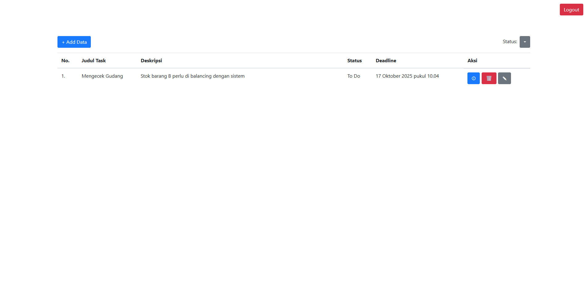
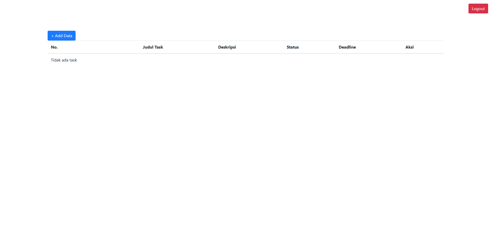
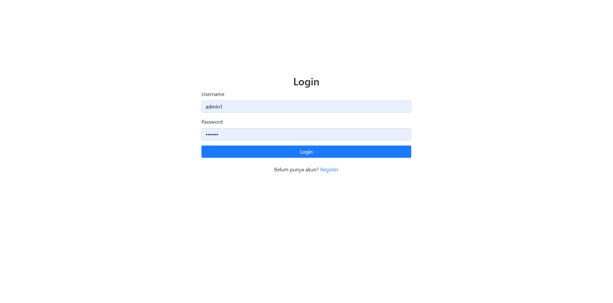
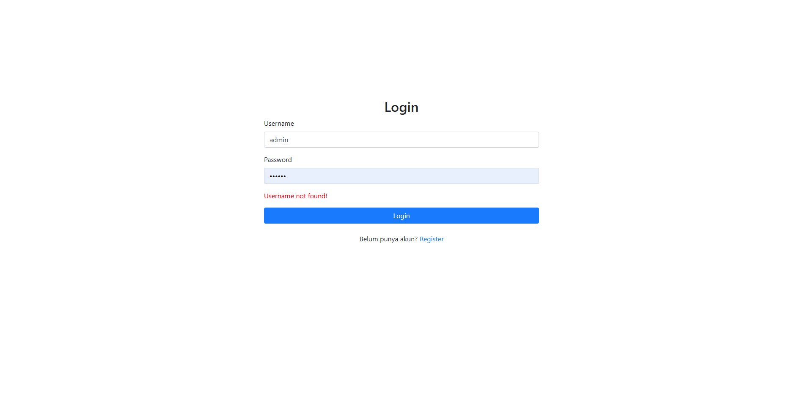
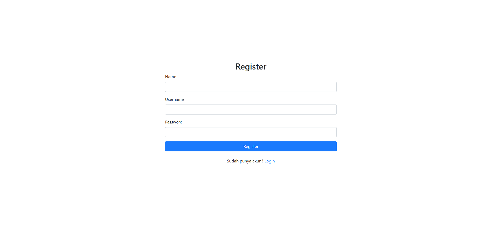
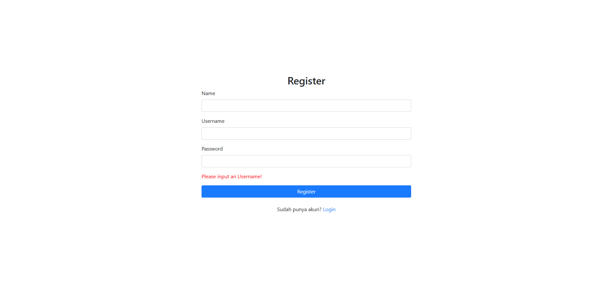